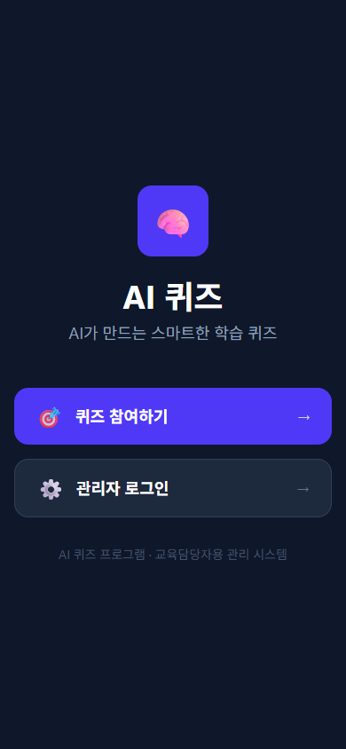
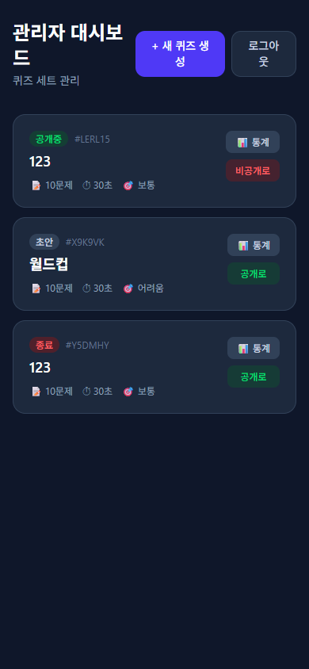
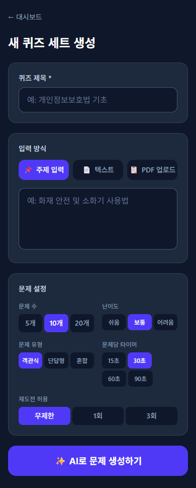
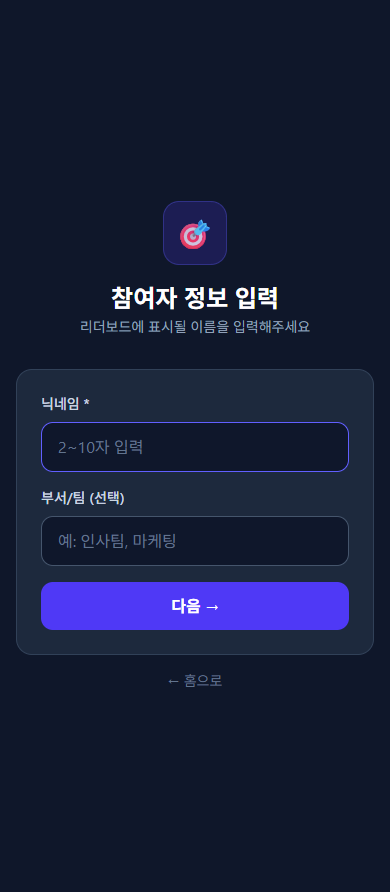

# 🧠 AI 퀴즈 — 사내 교육용 AI 퀴즈 플랫폼

> OpenAI GPT-4o가 자동으로 문제를 생성하고, 타이머 카운트다운과 실시간 리더보드로 학습 경쟁심을 높이는 사내 교육 퀴즈 시스템

---

## 📋 목차

1. [프로젝트 개요](#-프로젝트-개요)
2. [주요 기능](#-주요-기능)
3. [스크린샷](#-스크린샷)
4. [기술 스택](#-기술-스택)
5. [빠른 시작](#-빠른-시작)
6. [환경 변수 설정](#-환경-변수-설정)
7. [프로젝트 구조](#-프로젝트-구조)
8. [사용자 역할](#-사용자-역할)
9. [데이터 모델](#-데이터-모델)
10. [개발 로드맵](#-개발-로드맵)

---

## 🎯 프로젝트 개요

사내 교육 및 온보딩 과정에서 임직원의 학습 효과를 높이기 위한 **AI 기반 퀴즈 플랫폼**입니다.

- **교육담당자**는 주제·텍스트·PDF를 입력하면 GPT-4o가 자동으로 문제를 생성합니다.
- **임직원**은 닉네임만 입력하면 바로 퀴즈에 참여하고, 타이머 긴장감과 리더보드 경쟁을 통해 자연스럽게 학습 동기를 얻습니다.

### 핵심 가치

| 가치 | 설명 |
|------|------|
| 🤖 자동화 | OpenAI API로 문제를 자동 생성 — 교육담당자 업무 부담 최소화 |
| ⏱ 긴장감 | 문제당 카운트다운 타이머로 집중력 향상 |
| 🏆 경쟁 | 실시간 리더보드로 선의의 경쟁 유도 |
| ⚡ 실시간성 | Firebase 기반 실시간 데이터 동기화 |

---

## ✨ 주요 기능

### 교육담당자 (Admin)

- **퀴즈 세트 생성**: 주제 / 본문 텍스트 / PDF(최대 10MB) 중 선택
- **AI 문제 자동 생성**: GPT-4o가 객관식·단답형·혼합 문제 생성
- **문제 검토 및 편집**: 생성된 문제 수정, 삭제, 순서 변경
- **세트 공개 관리**: 공개/비공개 전환, 6자리 접근 코드 자동 발급
- **응시 현황 대시보드**: 문제별 오답률, 참여자별 점수 및 소요 시간

### 임직원 (Participant)

- **닉네임만으로 참여**: 별도 회원가입 없이 즉시 입장
- **타이머 퀴즈 진행**: 남은 시간에 따라 초록→노랑→빨강으로 색상 변화, 0초 시 자동 오답 처리
- **즉각적 결과 확인**: 정답률, 순위, 문제별 해설 표시
- **실시간 리더보드**: Firebase onSnapshot 기반 실시간 갱신

---

## 📸 스크린샷

### 홈 화면
> 퀴즈 참여와 관리자 로그인 진입점



---

### 관리자 인증 화면
> 환경변수로 설정한 비밀번호 입력 후 관리 화면으로 진입


---

### 관리자 대시보드
> 생성된 퀴즈 세트 목록, 공개/비공개 전환, 통계 접근



---

### 퀴즈 세트 생성
> 제목, 입력 방식, 문제 수·난이도·타이머 등 옵션 설정 후 AI 문제 자동 생성



---

### 참여자 닉네임 입력
> 닉네임(2~10자)과 선택적 부서/팀명 입력 후 퀴즈 목록으로 이동



---

### 퀴즈 진행 화면 (타이머 포함)
> 원형 카운트다운 타이머 + 진행률 바 + 객관식/단답형 문제

> 실제 Firebase 연결 후 활성화됩니다.

---

## 🛠 기술 스택

### 프론트엔드

| 항목 | 버전 |
|------|------|
| React | 19 |
| TypeScript | 6 |
| Vite | 8 |
| Tailwind CSS | 4 |
| Zustand | 5 |
| React Router | 7 |

### 백엔드 / 인프라

| 항목 | 설명 |
|------|------|
| Firebase Firestore | 실시간 데이터베이스 |
| Firebase Storage | PDF 파일 저장 |
| Firebase Cloud Functions | OpenAI API 서버 호출 |
| OpenAI GPT-4o | 문제 자동 생성 |

---

## 🚀 빠른 시작

### 1. 저장소 클론 및 의존성 설치

```bash
cd quiz-app
npm install
```

### 2. 환경 변수 설정

`quiz-app/.env` 파일을 생성하고 아래 내용을 채워주세요 ([환경 변수 설정](#-환경-변수-설정) 참조).

### 3. 개발 서버 실행

```bash
npm run dev
```

브라우저에서 `http://localhost:5173` 접속

### 4. 프로덕션 빌드

```bash
npm run build
npm run preview
```

---

## 🔧 환경 변수 설정

`quiz-app/.env` 파일을 생성하세요:

```env
# Firebase 프로젝트 설정
VITE_FIREBASE_API_KEY=
VITE_FIREBASE_AUTH_DOMAIN=
VITE_FIREBASE_PROJECT_ID=
VITE_FIREBASE_STORAGE_BUCKET=
VITE_FIREBASE_MESSAGING_SENDER_ID=
VITE_FIREBASE_APP_ID=

# 관리자 인증 (MVP — Firebase Auth 미사용)
# ⚠️ 클라이언트 번들에 포함되므로 사내망(VPN) 환경 전용으로 운영하세요.
VITE_ADMIN_PASSWORD=your_admin_password

# OpenAI API (Cloud Functions 배포 시 서버 환경변수로 관리)
# ⚠️ 클라이언트 코드에 절대 노출하지 마세요.
# OPENAI_API_KEY=  ← Cloud Functions 환경변수로만 설정
```

> **보안 주의**
> - `VITE_ADMIN_PASSWORD`는 빌드 번들에 포함됩니다. **반드시 사내망(VPN) 환경에서만** 배포하거나, Phase 2에서 Firebase Auth로 전환하세요.
> - OpenAI API 키는 클라이언트에 절대 노출하지 말고 Firebase Cloud Functions의 서버 환경변수로만 관리하세요.

---

## 📁 프로젝트 구조

```
quiz-app/
├── src/
│   ├── components/
│   │   ├── AdminRoute.tsx      # 관리자 전용 라우트 가드
│   │   └── Timer.tsx           # 원형 카운트다운 타이머
│   ├── lib/
│   │   ├── firebase.ts         # Firebase 초기화
│   │   ├── openai.ts           # OpenAI 문제 생성 호출
│   │   └── pdfParser.ts        # PDF 텍스트 추출
│   ├── pages/
│   │   ├── Home.tsx            # 홈 화면
│   │   ├── AdminLogin.tsx      # 관리자 로그인
│   │   ├── AdminDashboard.tsx  # 관리자 대시보드
│   │   ├── AdminStats.tsx      # 퀴즈 통계 화면
│   │   ├── CreateQuiz.tsx      # 퀴즈 세트 생성
│   │   ├── ReviewQuestions.tsx # 문제 검토 및 편집
│   │   ├── QuizEntry.tsx       # 닉네임 입력 + 퀴즈 선택
│   │   ├── QuizScreen.tsx      # 퀴즈 진행 (타이머 포함)
│   │   ├── Results.tsx         # 결과 화면
│   │   └── Leaderboard.tsx     # 실시간 리더보드
│   ├── store/
│   │   └── useStore.ts         # Zustand 전역 상태
│   ├── types.ts
│   ├── App.tsx
│   └── main.tsx
├── .env                        # 환경 변수 (직접 생성 필요)
├── package.json
└── vite.config.ts
```

---

## 👥 사용자 역할

### 교육담당자 (Admin)

1. `/admin/login`에서 환경변수 비밀번호 입력
2. 관리자 대시보드에서 퀴즈 세트 생성·관리
3. AI가 생성한 문제를 검토·편집 후 공개
4. 응시 현황 및 통계 확인

### 임직원 (Participant)

1. `/quiz`에서 닉네임 입력 (2~10자)
2. 공개된 퀴즈 목록에서 세트 선택
3. 타이머 카운트다운과 함께 퀴즈 진행
4. 결과 및 리더보드 확인, 재도전 가능

---

## 🗄 데이터 모델

Firebase Firestore 컬렉션 구조:

```
/quizSets/{setId}
  - title, description, status (draft|active|closed)
  - accessCode (6자리), settings (문제수·난이도·타이머·재도전)

  /questions/{questionId}
    - order, type (multiple|short), question, options[], answer, explanation

  /submissions/{submissionId}
    - nickname, department, score, totalTimeMs, answers[]

/leaderboards/{setId}
  - rankings[] (상위 50명 캐싱, onSnapshot 실시간 구독)
```

---

## 🗺 개발 로드맵

### Phase 1 — MVP ✅ 진행 중

- [x] Firebase Firestore/Storage/Functions 연동
- [x] 관리자 비밀번호 인증 (sessionStorage)
- [x] 퀴즈 세트 생성 (주제/텍스트/PDF)
- [x] OpenAI GPT-4o 문제 자동 생성
- [x] 타이머 카운트다운 퀴즈 진행
- [x] 결과 화면 + 실시간 리더보드

### Phase 2 — 기능 완성

- [ ] Firebase Authentication 도입 (Email/Password + Custom Claims)
- [ ] 문제 편집 기능 (수정·삭제·순서 변경)
- [ ] 관리자 대시보드 (오답률 분석, CSV 내보내기)
- [ ] 세트 코드 / QR 코드 공유

### Phase 3 — 고도화

- [ ] 부서별 리더보드 필터링
- [ ] 모바일 최적화 및 접근성 개선
- [ ] 문제 재생성 선택 기능
- [ ] 기간 설정 (세트 활성화 기간)

---

## 📄 관련 문서

- [AI_Quiz_PRD.md](AI_Quiz_PRD.md) — 전체 제품 요구사항 명세서 (v1.1)
- [api.md](api.md) — API 엔드포인트 명세

---

*버전 0.0.0 | 최종 수정: 2026-06-24*
